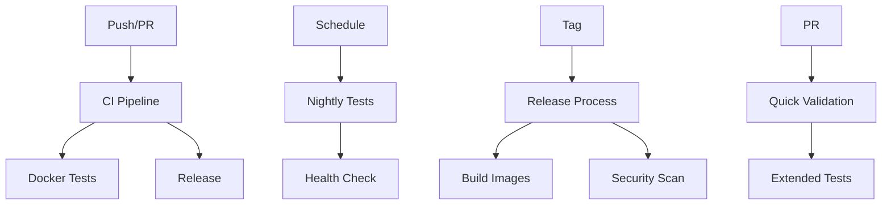

# GitHub Actions Workflows

This directory contains GitHub Actions workflows for automated testing, building, and deployment of the Low Cost Browsing MCP Server.

## 🔄 Available Workflows

### 1. **CI/CD Pipeline** (`ci.yml`)
**Triggers:** Push to main/develop, Pull Requests, Manual dispatch

**Jobs:**
- 🔍 **Lint & Format Check** - Code quality validation
- 🧪 **Unit Tests** - Jest unit testing
- 🐳 **Docker Tests** - Docker-based testing
- 🎭 **E2E Tests** - End-to-end browser testing (conditional)
- 🔒 **Security Scan** - Vulnerability scanning
- 🏗️ **Build Production** - Production Docker image
- 📊 **Coverage Analysis** - Code coverage reporting
- 🚀 **Deploy** - Deployment to staging/production

**Features:**
- Parallel job execution for speed
- Conditional E2E tests (only on specific labels/branches)
- Security scanning with Snyk
- Coverage reports with Codecov
- Artifact uploads for debugging

### 2. **Docker Testing** (`docker.yml`)
**Triggers:** Docker file changes, Manual dispatch, Daily schedule

**Jobs:**
- 🐳 **Docker Build Matrix** - Test all Docker targets (dev/test/prod)
- 🐳 **Docker Compose Test** - Validate docker-compose configurations
- 🔨 **Make Commands Test** - Validate all Makefile commands
- 🔧 **CI Scripts Test** - Test setup and CI scripts
- 🔒 **Security Scan** - Docker image vulnerability scanning
- ⚡ **Performance Test** - Build and execution performance
- 🏗️ **Multi-Architecture Test** - Cross-platform compatibility

**Features:**
- Matrix testing across all Docker targets
- Performance benchmarking
- Security scanning with Trivy
- Multi-architecture support preparation

### 3. **Release** (`release.yml`)
**Triggers:** Git tags (v*), Published releases, Manual dispatch

**Jobs:**
- 📋 **Prepare Release** - Version extraction and validation
- 🧪 **Pre-Release Tests** - Full test suite before release
- 🏗️ **Build Release Images** - Multi-target Docker images
- 📦 **Create Artifacts** - Source and build archives
- 🔒 **Security Scan** - Release security validation
- 🧪 **Test Release Images** - Validate published images
- 📝 **Update Release** - GitHub release with assets
- 📢 **Notification** - Deployment summary

**Features:**
- Automated versioning from git tags
- Multi-target image publishing to GitHub Container Registry
- Release artifacts with checksums
- Security scanning before release
- Automated release notes

### 4. **Pull Request** (`pr.yml`)
**Triggers:** PR events (opened, synchronized, reopened, ready_for_review)

**Jobs:**
- 🔍 **Quick Validation** - Fast feedback for PRs
- 🐳 **Docker Validation** - Docker changes validation
- 🔍 **Detect Changes** - Smart test selection based on changes
- 🐳 **Extended Docker** - Full Docker tests for Docker changes
- 🎭 **E2E Tests** - E2E tests for significant changes
- 📊 **Size Impact** - Docker image size analysis
- 🔒 **Security Check** - Security validation for PRs
- 📋 **PR Summary** - Automated PR validation summary
- 👥 **Assign Reviewers** - Smart reviewer assignment

**Features:**
- Smart test selection based on changed files
- Size impact analysis for Docker changes
- Automated reviewer assignment
- Security checks for new code
- Comprehensive PR validation summary

### 5. **Nightly Tests** (`nightly.yml`)
**Triggers:** Daily schedule (2 AM UTC), Manual dispatch

**Jobs:**
- 🏥 **Health Check** - System health validation
- 🧪 **Comprehensive Tests** - Multi-version testing matrix
- 🐳 **Docker Comprehensive** - Extensive Docker testing
- 🎭 **Extended E2E** - Full browser testing matrix
- ⚡ **Performance Benchmark** - Performance analysis
- 💪 **Stress Testing** - Load and stress testing (optional)
- 📦 **Dependency Audit** - Security and license checking
- 🧹 **Cleanup** - System cleanup and maintenance
- 📊 **Summary** - Results aggregation and issue creation

**Features:**
- Comprehensive testing across multiple Node.js versions
- Performance benchmarking and stress testing
- Dependency security and license auditing
- Automated issue creation for failures
- System health monitoring

## 🔧 Configuration

### Environment Variables
- `NODE_VERSION`: Node.js version for testing (default: '18')
- `DOCKER_BUILDKIT`: Enable Docker BuildKit (default: 1)
- `REGISTRY`: Container registry URL (default: ghcr.io)

### Secrets Required
- `GITHUB_TOKEN`: Automatically provided by GitHub
- `SNYK_TOKEN`: Snyk security scanning (optional)
- `CODECOV_TOKEN`: Codecov coverage reporting (optional)

## 🎯 Usage Examples

### Running Manual Workflows

```bash
# Trigger CI manually
gh workflow run ci.yml

# Trigger release with specific version
gh workflow run release.yml -f version=v1.2.3

# Trigger nightly with stress testing
gh workflow run nightly.yml -f stress_test=true
```

### PR Labels for Special Behaviors

- `run-e2e`: Force E2E tests on PR
- `skip-tests`: Skip CI tests (use carefully)
- `priority-high`: Mark as high priority

### Branch Protection Rules

Recommended branch protection for `main`:
- Require status checks: `lint`, `unit-tests`, `docker-tests`
- Require up-to-date branches
- Require review from code owners
- Restrict pushes to specific users/teams

## 📊 Monitoring and Notifications

### Success Indicators
- ✅ All status checks pass
- 📊 Coverage maintains >80%
- 🔒 No security vulnerabilities
- ⚡ Performance within expected ranges

### Failure Responses
- 🚨 Automatic issue creation for nightly failures
- 📧 Notifications to maintainers
- 🔄 Automatic retry for flaky tests
- 📊 Detailed failure summaries

## 🔄 Workflow Dependencies



## 🛠️ Maintenance

### Regular Tasks
1. Update Node.js versions in matrix testing
2. Review and update security scanning tools
3. Monitor workflow execution times
4. Update dependencies in workflow files
5. Review and optimize artifact retention

### Troubleshooting Common Issues

**E2E Test Failures:**
```bash
# Known issue with browser paths in Docker
# Workaround: Tests continue with warning
```

**Docker Build Timeouts:**
```bash
# Increase timeout or optimize Dockerfile layers
# Use BuildKit cache for faster builds
```

**Security Scan Failures:**
```bash
# Review and update vulnerable dependencies
# Add exceptions for false positives
```

## 📚 Resources

- [GitHub Actions Documentation](https://docs.github.com/en/actions)
- [Docker Official Actions](https://github.com/docker/build-push-action)
- [Playwright GitHub Actions](https://playwright.dev/docs/ci-github-actions)
- [Security Best Practices](https://docs.github.com/en/actions/security-guides)
