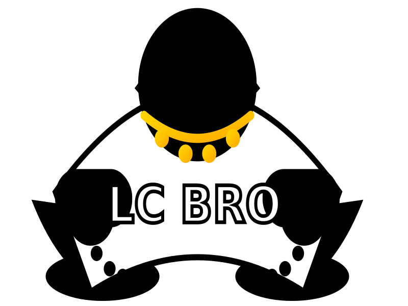

  
  
# LCBro Documentation Languages

LCBro supports multiple languages for documentation:

## English (Default)
- [README.md](README.md) - Full documentation in English

## Russian
- [README.ru.md](README.ru.md) - Полная документация на русском языке

## Portuguese
- [README.pt.md](README.pt.md) - Documentação completa em português

---

**Current default language:** English  
**Available languages:** English, Русский, Português  
**Idiomas disponíveis:** English, Русский, Português
